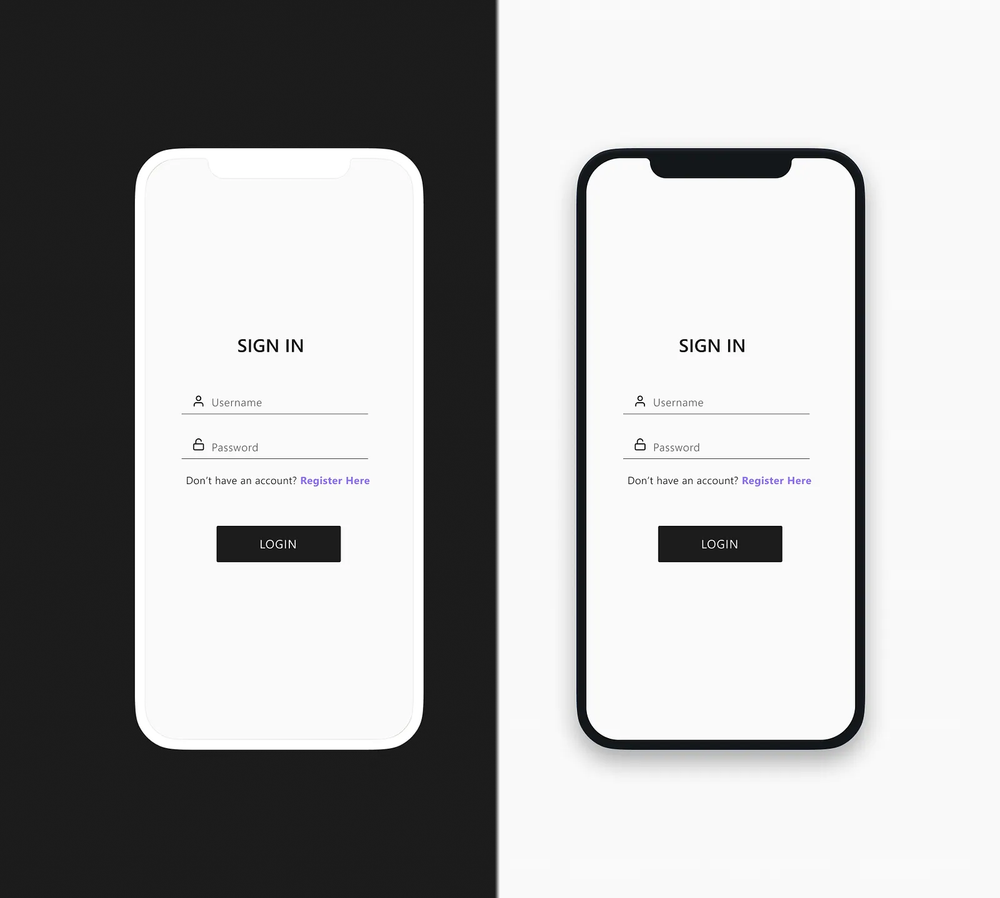
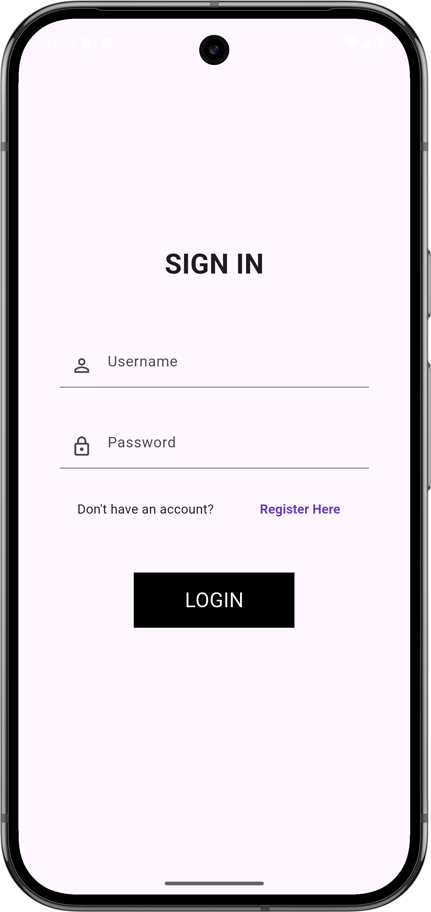

---

# Login Screen - Flutter App

This is a simple Flutter application featuring a functional login screen. The project uses the `Provider` pattern to manage state and validate input fields.

## 📱 Features

* Login form with field validation.
* Feedback messages via `SnackBar`.
* Uses the `Provider` package for state management.
* Centered and responsive layout.
* Clean UI design with `InkWell` for button tap feedback.

## 🛠️ Technologies Used

* [Flutter](https://flutter.dev/)
* [Provider](https://pub.dev/packages/provider)

## 📁 Project Structure

```
lib/
├── controller/
│   └── providers/
│       └── login_provider.dart      # Manages state and validation logic
├── view/
│   ├── pages/
│   │   └── login_page.dart          # Login screen UI
│   └── widgets/
│       └── my_app.dart              # App setup, routes, and theme
├── main.dart                        # Entry point of the application
```
## 📸 Before vs After

| **Before (Inspiration)**            | **After (Final Result)**          |
|-------------------------------------|-----------------------------------|
|  |  |


## 🚀 Getting Started

1. **Clone the repository:**

```bash
git clone https://github.com/your-username/login_screen.git
cd login_screen
```

2. **Install dependencies:**

```bash
flutter pub get
```

3. **Run the app:**

```bash
flutter run
```

> Ensure Flutter is correctly installed and configured on your development machine.

## 🧪 Demo

If you fill in both fields with non-empty text and press **LOGIN**, a green `SnackBar` will be shown. If any field is empty, a red `SnackBar` will appear.

## 📌 Notes

* The **"Register Here"** button is currently disabled (no action assigned) and can be implemented later to navigate to a registration page.
* The validation is basic: it only checks if the fields are not empty.

## 📄 License

This project is free to use for learning purposes. License to be defined as needed.

---